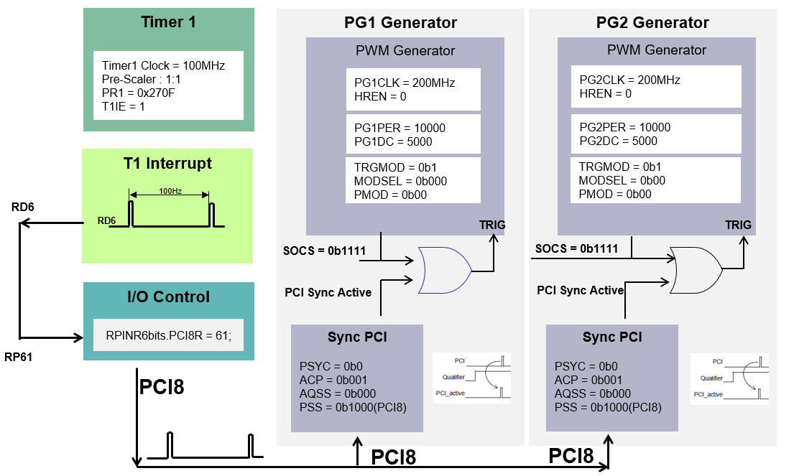
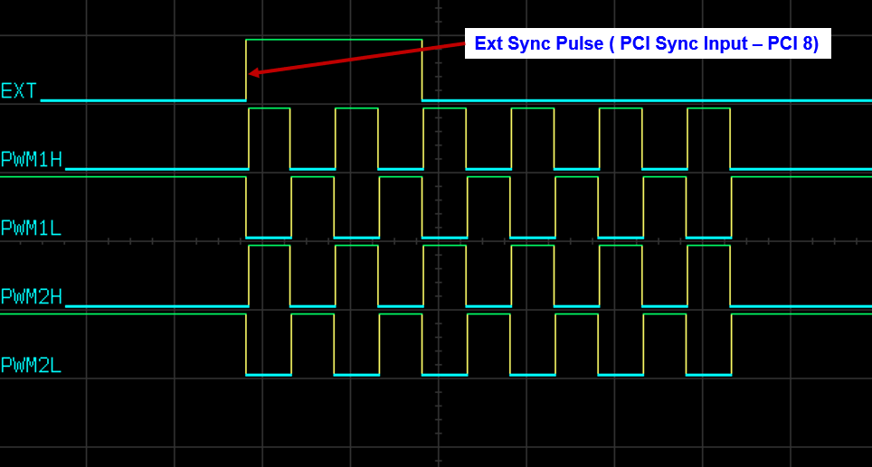
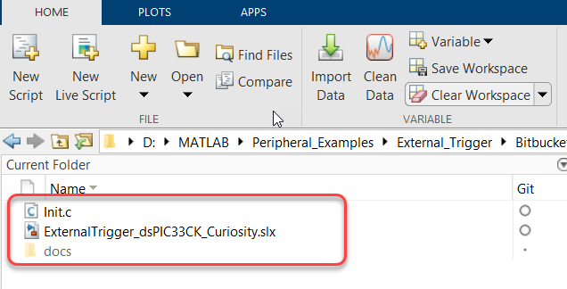

 

# PWM Peripheral Example: 
# External Synchronization - Sync PCI Feature of PWM using dsPIC33CK Curiosity Board and MATLAB SIMULINK

## 1. INTRODUCTION
This document describes the synchroniztion of PWM with an external pulse. This example explores Sync PCI feature of High Resolution PWM module in the dsPIC33CK to implement it. The demonstration uses the dsPIC33CK curiosity development board with MATLAB and SIMULINK.

### 1.1 External synchronization using Sync PCI Feature 
The two PWM generators, PG1 and PG2 used in the example are configured in Independent edge, Complementary mode. 

Also, a Timer1 module is configured to generate a pulse signal at 100Hz on output port pin RD6. Another port pin, RC13(RP61/PWM8L/PMA5/RC13), is configured as the PWM PCI8.  The output pulse on port RD6 is applied to port RP61 by interconnecting them to produce an external synchronization signal to synchronize PG1 and PG2 generators.

The start of the cycle (SOCS PGxCONH<3:0>) of PG1 and PG2 are set to 0b1111 (PWM PCI sync function) to start on the PCI sync output. The input of the PCI sync block is the external signal applied on port RC13. Also, the sync polarity is set to High to trigger it on a rising edge of the external signal.

  

  

When a rising edge is detected on the external synchronization signal applied on the port RC13/RP61(configured as PCI8), the PG1 and PG2 produce output pulses on PWM1H and PWM2H. Observe that the start of the cycle of both PG1 and PG2 is synchronized with the rising edge of the external sync signal.

In this configuration, the PWM generators PG1 and PG2 will send out PWMs only after detecting the external synchronization signal; before that, no PWM pulses are observed. 

  

  

## 2.	SUGGESTED DEMONSTRATION REQUIREMENTS
### 2.1 MATLAB Model Required for the Demonstration
-  MATLAB model can be cloned or downloaded as zip file from the Github repository ([link](https://github.com/microchip-pic-avr-examples/matlab-dspic33ck-curiosityboard-pwmexample-external-syncpci)).

### 2.2	Software Tools Used for Testing the MATLAB/Simulink Model
1.	MPLAB X IDE and IPE (v6.00)
2.	XC16 compiler (v2.00)
3.	MATLAB R2023a
4.	Required MATLAB add-on packages
    -	Simulink
    -	Simulink Coder
    -	MATLAB Coder
    -	Embedded Coder (v7.9)
    -	MPLAB Device blocks for Simulink (v3.50.35)

> **_NOTE:_**
>The software used for testing the model during release is listed above. It is recommended to use the version listed above or later versions for building the model.

### 2.3	Hardware Tools Required for the Demonstration
- dsPIC33CK Curiosity Development Board ([DM330030](https://www.microchip.com/en-us/development-tool/DM330030))

> **_NOTE:_**
>All items listed under this section Hardware Tools Required for the Demonstration are available at [microchip DIRECT](https://www.microchipdirect.com/).

## 3. HARDWARE SETUP

This section describes hardware setup required for the demonstration.

1. The board has an onboard programmer **'PICkit™ On Board (PKoBv4)'**, which can be used for programming or debugging the dsPIC33CK256MP508. To use the on-board programmer, connect a micro-USB cable between Host PC and Micro USB **connector J7** provided on the dsPIC33CK Curiosity Development Board. 

    

    
 

2. Make sure that the **Jumper J11** is on the **+5V USB Power** side to power the dsPIC33CK Curiosity Development Board from Host PC through the USB cable. 
 

    

    

3. Interconnect the pins RD6 and RC13 on the dsPIC33CK curiosity board.

4. Connect the PWM pins RB10, RB11, RB12 and RB13 to the oscilloscope to monitor the PWM signals. 

## 4.	BASIC DEMONSTRATION

 Follow the instructions step-by-step, to set up and run the demo example:

1. Launch MATLAB (refer the section [“2.2 Sofware Tools Used for Testing the MATLAB/Simulink Model"](#22-software-tools-used-for-testing-the-matlabsimulink-model)).
 
2. Open the folder downloaded from the repository, in which MATLAB files are saved (refer the section ["2.1 MATLAB Model Required for the Demonstration"](#21-matlab-model-required-for-the-demonstration)).

    

    

3.	
Double click on the Simulink model.

    

      

    

    
4.	
From this Simulink model an MPLAB X project can be generated. To generate the code from the Simulink model, go to the <b>"MICROCHIP"</b> tab, and enable the tabs shown in the figure below. 

    

      

    

5.	
	To generate the code and program the dsPIC, click on <b>‘Build Model’ or ‘Clean Build Model’</b> option under the <b>“Microchip”</b> tab. This will generate the MPLAB X project from the Simulink model and program the dsPIC33CK256MP508 device.

    

      

    

6.	
After completing the process, the <b>‘Operation Succeeded’</b> message will be displayed on the <b>‘Diagnostics Viewer’</b>.

    

      

    

7.	
If the device is successfully programmed, <b>LED1 and LED2</b> will be blinking. 

8. Monitor the PWM signals on the pins RB10, RB11, RB12 and RB13 using oscilloscope.

##  5. ADDING C SOURCE FILE TO THE SIMULINK MODEL:
The model incorporates a C source file, which has configurations required to implement various PWM scheme Sync PCI feature of the High Resolution PWM. Follow the steps below to add a C source file into the Simulink model.

1. In the **Modelling** tab, click on the **Model Settings**.

    

      

    

2.	Expand the **Code Generation** tab and click on the **Custom Code**.

    

      

    

3.	In the **Include directories**, add the path of the C source file. If the C source file is in the same directory as the Simulink model, then give **“./”**.

    

      

    

4.	In the **Source files tab**, enter the C source file name which needs to be included. Then click **Apply**.

    

      

    

## 	6. REFERENCES:
For more information, refer to the following documents or links.

1. [dsPIC33CK256MP508 Family Datasheet](https://ww1.microchip.com/downloads/en/DeviceDoc/dsPIC33CK256MP508-Family-Data-Sheet-DS70005349H.pdf)
2. [dsPIC33/PIC24 High-Resolution PWM with Fine Edge Placement Family Reference Manual](http://ww1.microchip.com/downloads/en/DeviceDoc/dsPIC33-PIC24-FRM-High-Resolution-PWM-with-Fine-Edge-Placement-70005320b.pdf)
3. [dsPIC33CK Curiosity Development Board User’s Guide](https://ww1.microchip.com/downloads/aemDocuments/documents/MCU16/ProductDocuments/UserGuides/dsPIC33CK-Curiosity-Development-Board-User%27s-Guide-DS50002859A.pdf)
4.	[MPLAB® X IDE installation](https://microchipdeveloper.com/mplabx:installation)
5.	[MPLAB® XC16 Compiler installation](https://microchipdeveloper.com/xc16:installation)
6.  [MPLAB Device Blocks for Simulink :dsPIC, PIC32 and SAM mcu](https://in.mathworks.com/matlabcentral/fileexchange/71892-mplab-device-blocks-for-simulink-dspic-pic32-and-sam-mcu)
